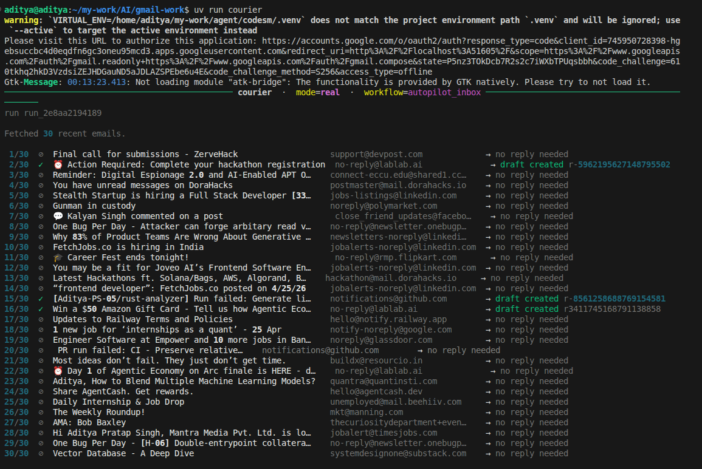
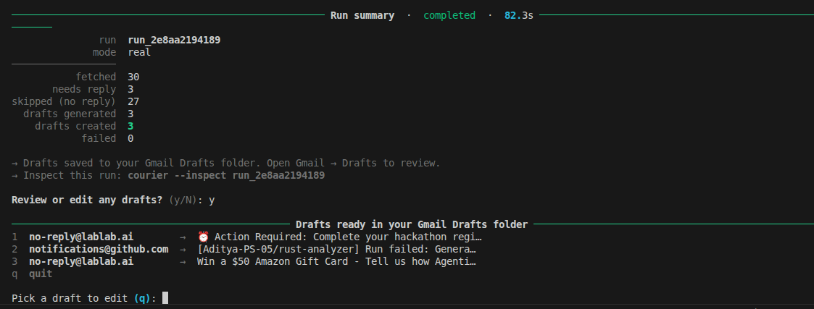
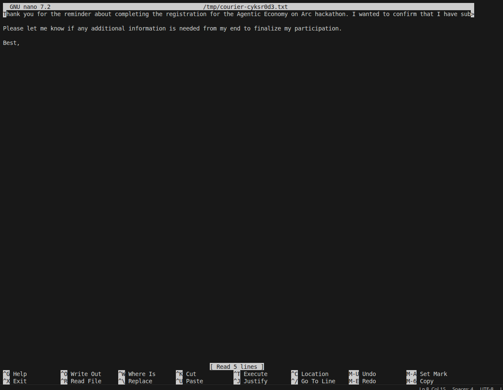
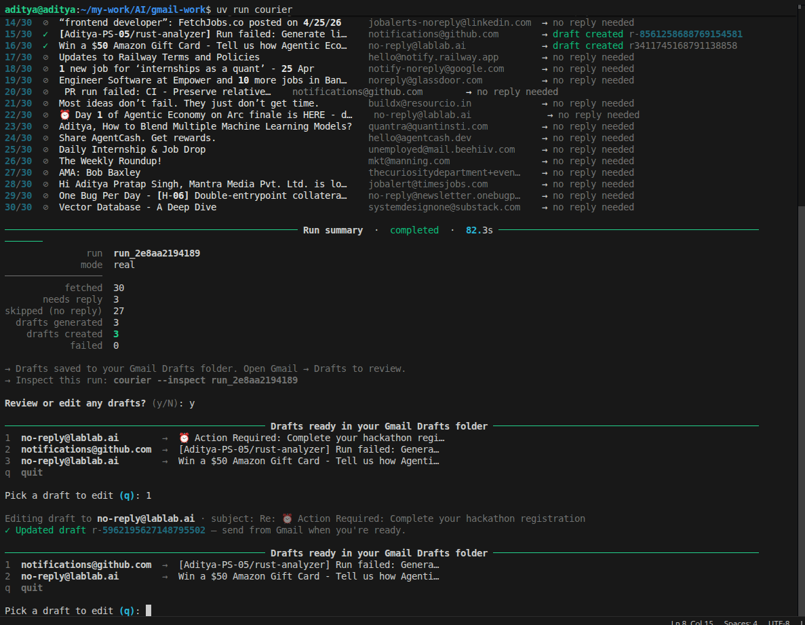
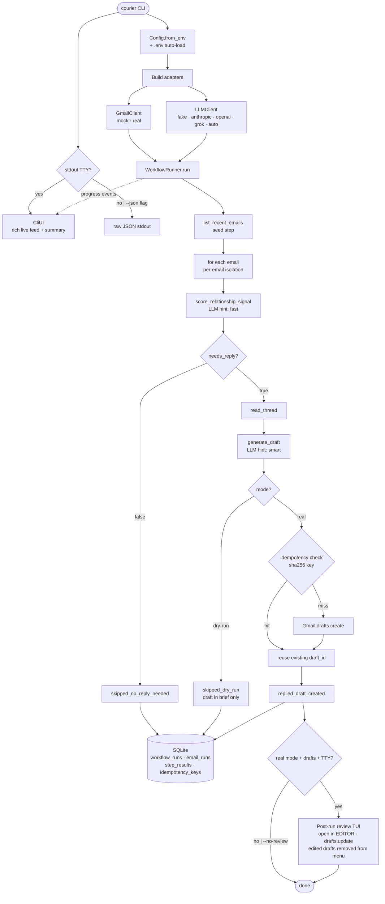

<!-- <CENTERED SECTION FOR GITHUB DISPLAY> -->

<div align="center">
<h1>courier</h1>
</div>

> Gmail workflow runner that fetches recent emails, scores each for reply-worthiness, generates drafts, and creates them safely — one clear boundary at a time.

> [!TIP]
>
> Multi-LLM (Anthropic / OpenAI / Grok / auto-route), dry-run + real mode, SQLite persistence, content-addressed idempotency. <br />
> **Hard rule: this system never sends email. It creates drafts only, always gated by `--mode`.**
>
> | [](https://github.com/Aditya-PS-05) | Follow [@Aditya-PS-05](https://github.com/Aditya-PS-05) on GitHub for more projects. Hacking on AI infrastructure and everything in between. |
> | :-----| :----- |

<div align="center">

[](https://www.python.org/)
[](./tests/)
[](https://docs.astral.sh/ruff/)
[](https://github.com/Aditya-PS-05/courier/stargazers)
[](https://github.com/Aditya-PS-05/courier/issues)
[](./LICENSE)

</div>

<!-- </CENTERED SECTION FOR GITHUB DISPLAY> -->

> **Run [`uv sync && courier --mode dry-run`](#quickstart) and watch the full pipeline run end-to-end with zero credentials — mock Gmail, deterministic LLM, structured output.**

## Overview

**courier** is a workflow runner designed for a relationship-CRM "AutoPilot" model. Each email gets scored for reply-worthiness, its thread is read, a short draft is generated, and a Gmail draft is created — all through clean, swappable adapter boundaries.

The workflow never sends. `create_draft` is gated by `--mode real`; in dry-run mode it's skipped with the proposed draft still visible in the output. A rerun on the same inbox produces zero duplicate drafts.

---

## Screenshots

**Live email feed** — per-email progress as the pipeline runs



**Run summary + draft review** — structured summary followed by the interactive draft picker



**Draft editor** — selected draft opens in `$EDITOR` for editing before pushing back to Gmail



**Full run overview** — complete output from start to finish



---

## Quickstart

This project uses [uv](https://docs.astral.sh/uv/) for environment management and [ruff](https://docs.astral.sh/ruff/) for lint + format.

```bash
uv sync                                # creates .venv, installs deps
courier --mode dry-run --limit 6      # mock Gmail + fake LLM
# or: uv run python -m courier --mode dry-run
```

Defaults use `MockGmailClient` and `FakeLLMClient` — no credentials needed. You'll see a rich live feed on stdout if connected to a TTY, or raw JSON if piped.

```bash
uv run pytest tests/ -v      # 18 tests, all green, ~4s
uv run ruff check .
uv run ruff format .
```

Inspect a previous run after the process exits:

```bash
courier --inspect run_abc123def012
# or query SQLite directly
sqlite3 runs.db "SELECT id, mode, status, duration_ms FROM workflow_runs ORDER BY started_at DESC LIMIT 5"
sqlite3 runs.db "SELECT step_name, status, retry_count, duration_ms FROM step_results WHERE workflow_run_id='run_...' ORDER BY id"
```

Run with real LLM + real Gmail:

```bash
uv sync --extra anthropic --extra openai --extra google

# Anthropic Claude
ANTHROPIC_API_KEY=sk-ant-... courier --gmail real --llm anthropic --mode dry-run

# OpenAI GPT
OPENAI_API_KEY=sk-... courier --gmail real --llm openai --mode dry-run

# xAI Grok (same OpenAI SDK, different base_url)
XAI_API_KEY=xai-... courier --gmail real --llm grok --mode dry-run

# Auto-route across whichever keys are configured
courier --gmail real --llm auto --mode dry-run
```

Drop `--mode dry-run` to write drafts to Gmail. First run opens a browser for OAuth; the resulting token is cached as `token.json`.

---

## Examples

**Try it instantly — no credentials needed**
```bash
courier --mode dry-run --limit 5
```
Uses mock Gmail and a deterministic fake LLM. Full pipeline runs end-to-end in under a second.

---

**Real Gmail, see what would be drafted (safe — no writes)**
```bash
courier --gmail real --llm anthropic --mode dry-run --limit 20
```
Fetches your actual inbox, scores each email, generates draft text — but never touches Gmail Drafts.

---

**Real Gmail, write drafts**
```bash
courier --gmail real --llm auto --mode real --limit 20
```
Runs the full pipeline. Drafts land in your Gmail Drafts folder. OAuth browser window opens on first run.

---

**Review and edit drafts interactively after the run**
```bash
courier --gmail real --llm auto --mode real
# → "Review or edit any drafts? (y/N): y"
# → pick a number, draft opens in $EDITOR
# → save → pushed back to Gmail via drafts.update
```

---

**Quiet mode — summary only, no per-email lines**
```bash
courier --gmail real --llm auto --mode real -q
```

---

**Pipe mode — machine-readable JSON output**
```bash
courier --mode dry-run --json | jq '.summary'
```

---

**Inspect a previous run**
```bash
courier --inspect run_2e8aa2194189
# or query SQLite directly
sqlite3 runs.db "SELECT step_name, status, duration_ms FROM step_results WHERE workflow_run_id='run_...' ORDER BY id"
```

---

**Rerun safely — already-drafted threads are skipped**
```bash
courier --gmail real --llm auto --mode real
# second run on same inbox:
# → "already drafted: 3 skipped"
# → only new threads get processed
```

---

## Architecture

Every layer boundary is a `Protocol` or a typed Pydantic model — never a concrete class. The flow below traces a single CLI invocation from command to SQLite commit.



### The five tools

| name | what it does |
|---|---|
| `list_recent_emails` | seed step — fetch N most recent emails |
| `score_relationship_signal` | LLM step — `needs_reply` + `confidence` + `why_now` |
| `read_thread` | branch — only runs when `needs_reply == true` |
| `generate_draft` | LLM step — produces a validated `DraftContent` |
| `create_draft` | the only Gmail write — gated by mode, idempotency-checked |

### Dry-run vs real mode

The engine refuses to execute `create_draft` while `mode=="dry-run"`. The step is recorded as `skipped_dry_run` with a "would have created draft" note. The action brief still carries the proposed `suggested_message` so a reviewer sees exactly what *would* have been written.

### Idempotency

Before `create_draft` calls Gmail, it computes:

```
key = sha256(workflow_name | thread_id | normalized(body))[:32]
```

If the key exists in `idempotency_keys`, the existing draft ID is reused and the step records `was_idempotent_hit=true`. Reruns produce zero duplicate drafts as long as the LLM produces the same body for the same input.

Why content-addressed instead of `(thread_id)` alone? A meaningfully different draft on a later run is a legitimately new artifact — we should not suppress it. We only suppress byte-identical content.

> There is a small known window: if Gmail succeeds but the local DB write fails, a rerun may create a duplicate. A two-phase commit would close the gap; documented in `tools/create_draft.py` as a known limitation.

### Error model

Three error types, normalized at every adapter boundary:

| error | behavior |
|---|---|
| `TransientError` | retried with exponential backoff + jitter, max 3 attempts |
| `PermanentError` | recorded on the email's brief; run continues to next email |
| `AuthError` | fatal — aborts the entire run |

`ValidationError` is a subtype of `PermanentError` for typed/schema failures (e.g. malformed LLM output).

### Multi-LLM routing

Pass `--llm auto` (or `BRACE_LLM_BACKEND=auto`) and the system builds a `RoutedLLM` from whichever API keys are present. Each workflow step declares a `model_hint` (`"fast"` / `"smart"` / `"cheap"`), and the router tries providers in priority order, falling through on `AuthError` or `PermanentError`:

| hint | default order | adapters used |
|---|---|---|
| fast | openai → grok → anthropic | `gpt-4o-mini` / `grok-3-mini` / `claude-haiku-4-5` |
| smart | anthropic → openai → grok | `claude-sonnet-4-6` / `gpt-4o` / `grok-3` |
| cheap | grok → openai → anthropic | `grok-3-mini` / `gpt-4o-mini` / `claude-haiku-4-5` |

Override per-hint order via `BRACE_LLM_PREFERENCE_FAST`, `BRACE_LLM_PREFERENCE_SMART`, `BRACE_LLM_PREFERENCE_CHEAP` (comma-separated provider names).

### Post-run draft review TUI

After a real-mode run that created at least one draft, the CLI prompts to review drafts interactively (skip with `--no-review`). Selecting a draft opens it in `$EDITOR` (falls back to `nano` / `vim`). On save, the edited body is pushed back to Gmail via `drafts.update`. Edited drafts are removed from the menu automatically; when all are reviewed the loop exits.

### Per-email isolation

Each email runs in its own `try/except` inside the fan-out. A failure on one email never poisons the rest of the run. `RunSummary` reports `failed` count alongside `drafts_created` so the operator sees both successes and failures in one place.

### Observability

Every step writes a row to `step_results` with input hash, duration, retry count, status, and a redacted output summary. Stderr emits structured JSON lines tagged with `workflow_run_id`, `step_name`, `tool_name`, `mode`, `duration_ms`, `retry_count`. **Email bodies are never logged** — only IDs, subjects, and aggregate counts.

---

## Features

- **Multi-Cloud LLM** — Unified `LLMClient` interface across Anthropic, OpenAI, Grok. Swap without touching the workflow.
- **Auto-Routing** — `RoutedLLM` selects provider per step hint with fallthrough. Works with any subset of API keys.
- **Dry-Run Gate** — `create_draft` is the only write tool; the engine skips it in dry-run mode. Enforced centrally, no per-tool forks.
- **Content-Addressed Idempotency** — `sha256(workflow | thread_id | body)[:32]`. Reruns are safe.
- **SQLite Persistence** — Workflow runs, email runs, step results, idempotency keys. Survives process exit. Inspectable via `--inspect`.
- **Retry with Jitter** — `TransientError` only, exponential backoff, `BRACE_RETRY_NO_SLEEP=1` for tests.
- **Rich TUI** — TTY auto-detected. Live per-email feed + summary grid in TTY mode; raw JSON in pipe mode.
- **Draft Review Loop** — Post-run interactive editor. Edited drafts removed from menu. Auto-exits when all reviewed.
- **Protocol Boundaries** — `GmailClient`, `LLMClient`, `MemoryProvider` are `Protocol`s. Implementations are interchangeable without touching the engine.
- **Real Gmail OAuth** — Browser-based OAuth on first run, token cached as `token.json`. MIME encoding, thread-aware.
- **18 Tests, Zero Credentials** — `MockGmailClient.fail_on_next_call(op, error)` + `FakeLLMClient.fail_on_next_call(schema, error)` make failure simulation a one-liner.

---

## Configuration

courier reads config from environment variables. All have sensible defaults.

| Variable | Default | Description |
|---|---|---|
| `BRACE_MODE` | `dry-run` | `dry-run` or `real` |
| `BRACE_LIMIT` | `20` | Max emails to fetch per run |
| `BRACE_GMAIL_BACKEND` | `mock` | `mock` or `real` |
| `BRACE_LLM_BACKEND` | `fake` | `fake`, `anthropic`, `openai`, `grok`, `auto` |
| `BRACE_DB_PATH` | `runs.db` | SQLite database path |
| `BRACE_LOG_LEVEL` | `WARNING` | `DEBUG`, `INFO`, `WARNING`, `ERROR` |
| `ANTHROPIC_API_KEY` | — | Required for `--llm anthropic` or `--llm auto` |
| `OPENAI_API_KEY` | — | Required for `--llm openai` or `--llm auto` |
| `XAI_API_KEY` | — | Required for `--llm grok` or `--llm auto` |
| `GOOGLE_CREDENTIALS_PATH` | — | Required for `--gmail real` (OAuth client secrets JSON) |
| `BRACE_LLM_PREFERENCE_FAST` | `openai,grok,anthropic` | Provider order for `fast` hint |
| `BRACE_LLM_PREFERENCE_SMART` | `anthropic,openai,grok` | Provider order for `smart` hint |
| `BRACE_LLM_PREFERENCE_CHEAP` | `grok,openai,anthropic` | Provider order for `cheap` hint |
| `BRACE_RETRY_NO_SLEEP` | — | Set to `1` in tests to skip backoff sleeps |

Place these in a `.env` file at the project root — `python-dotenv` loads it automatically on startup (`override=False`, so shell env takes precedence).

### CLI flags

```
courier [OPTIONS]

  --mode dry-run|real     override BRACE_MODE
  --limit N               override BRACE_LIMIT
  --gmail mock|real       override BRACE_GMAIL_BACKEND
  --llm fake|anthropic|openai|grok|auto
  --db PATH               SQLite path (default: runs.db)
  --inspect RUN_ID        print a stored run record and exit
  --json                  force JSON output (no interactive UI)
  -q, --quiet             hide per-email progress; summary only
  -v, --verbose           emit structured JSON logs to stderr
  --no-color              disable ANSI color (also: NO_COLOR env)
  --no-review             skip post-run draft editor (non-interactive use)
```

---

## Test coverage

`pytest tests/` — 18 tests, all green (~4s). Every failure mode runs against the mocks; no network or credentials needed.

| test | what it proves |
|---|---|
| `test_dry_run_does_not_create_drafts` | dry-run mode never creates Gmail drafts |
| `test_real_mode_creates_drafts` | real-mode actually writes to (mock) Gmail |
| `test_rerun_does_not_duplicate_drafts` | idempotency works across runs |
| `test_one_email_fails_others_continue` | per-email isolation under permanent errors |
| `test_transient_error_is_retried` | timeouts retry transparently |
| `test_malformed_llm_output_marks_email_failed` | LLM `ValidationError` is recorded, not crashed |
| `test_persisted_run_can_be_inspected` | run state is durable in SQLite |
| `test_emails_without_reply_skip_thread_and_draft` | branching cuts work |
| `test_routed_uses_first_provider_when_healthy` | RoutedLLM picks primary provider |
| `test_routed_falls_through_on_permanent_error` | permanent error falls through to next provider |
| `test_routed_falls_through_on_auth_error` | auth error falls through to next provider |
| `test_routed_falls_through_on_transient_then_succeeds` | transient error retried across providers |
| `test_routed_raises_transient_when_all_fail_transient` | all-transient raises correctly |
| `test_routed_uses_separate_routes_per_hint` | fast/smart routes are independent |
| `test_update_draft_replaces_body_in_place` | `drafts.update` overwrites body |
| `test_update_draft_can_change_subject_too` | `drafts.update` overwrites subject |
| `test_update_draft_records_updated_at` | `drafts.update` timestamps the edit |
| `test_update_draft_unknown_id_raises_permanent` | unknown draft ID → `PermanentError` |


---

## How I used AI coding tools

**What I designed myself**
- The layer split (adapters / tools / engine / state / reliability) and the rule that nothing crosses a layer except via a `Protocol` or a Pydantic model.
- The dry-run gate design: marking `create_draft` as the sole write tool and enforcing the skip centrally in the engine, instead of branching in every tool.
- The content-addressed idempotency key keyed on `(workflow, thread_id, normalized_body)`, including the deliberate choice to *not* key on `thread_id` alone.
- The three-error taxonomy (`TransientError` / `PermanentError` / `AuthError`) and the rule that adapters normalize every external exception into one of these.
- The `MemoryProvider` extension point — lets contact context flow into both the classifier and the draft generator without changing the workflow.
- The `EmailActionBrief` output shape with `why_now` and `signal_score` as first-class fields.
- The decision to make the engine ~250 lines and *not* build Temporal/Airflow.

**What I asked AI to generate**
- Boilerplate Pydantic field declarations.
- The OAuth bootstrapping and MIME-tree walking in `gmail_real.py`.
- The SQL schema string.
- The fixture inbox JSON (6 emails, mix of needs-reply / no-reply).
- The structured-log formatter skeleton.

**What I modified or rejected**
- AI's first cut at the runner used a generic `try/except` that also swallowed `AuthError`. I rewrote the auth path so an auth failure aborts the entire run instead of being recorded on a single email.
- AI proposed wrapping every tool call in a generic retry. I narrowed retries to `TransientError` only (so malformed JSON from the LLM does not silently retry forever) and made `max_attempts` a per-step setting.
- AI's idempotency suggestion was keyed on `(thread_id)` only. Rejected because legitimately different LLM drafts on a later run would be suppressed; switched to content-addressed.
- AI wanted to log full email bodies for "easier debugging." Rejected — bodies never enter logs; only IDs, subjects, and counts.

**How I tested generated code**
- A hand-written end-to-end smoke test (`courier --mode dry-run`) exercises the full pipeline.
- 18 pytest tests cover every failure mode using `MockGmailClient.fail_on_next_call(...)` and `FakeLLMClient.fail_on_next_call(...)`. No network, no credentials.

**What I avoided delegating**
- The trust boundary. Deciding which tool is the sole write operation, what gets logged, what counts as transient vs permanent — those decisions live in my head, not in a prompt.
- The output shape. `AutoPilotRun`, `EmailActionBrief`, `why_now`, `MemoryProvider` — deliberate architectural choices, not generated artifacts.
- The known-limitation note in `tools/create_draft.py` about the create-then-record window. AI would have written confident "this is fully atomic" claims; I explicitly documented the gap.

---

## License

<p align="center">
  <strong>MIT © <a href="https://github.com/Aditya-PS-05">Aditya Pratap Singh</a></strong>
</p>

If you find this project useful, **please consider starring it ⭐** or [follow me on GitHub](https://github.com/Aditya-PS-05) for more work on AI infrastructure. Issues, PRs, and ideas all welcome.
